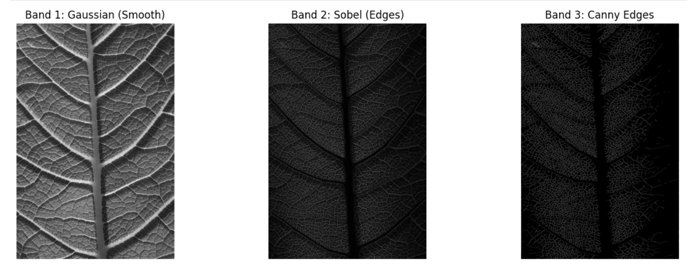
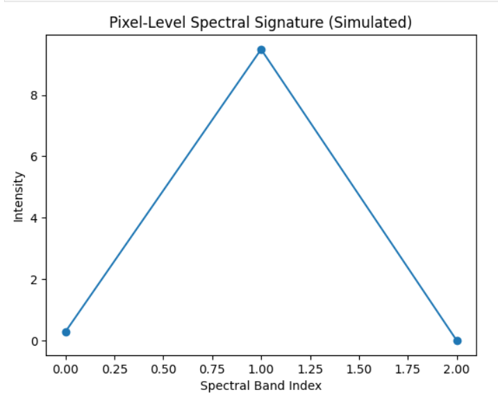
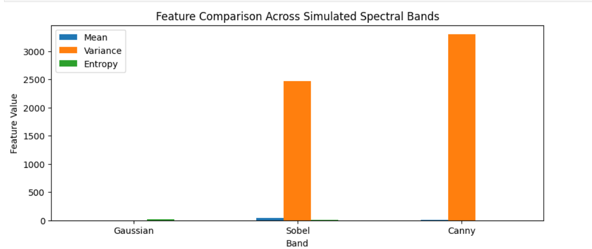

# Simulated Hyperspectral Image Analysis

## 1. Project Overview
This project demonstrates a **simulated hyperspectral imaging pipeline** using a single RGB image (`sample_image.jpeg`).  
Hyperspectral imaging captures multiple spectral bands per pixel, providing detailed information beyond human vision.  

In this project, we simulate three bands using standard image processing techniques:

1. **Gaussian Filter** – captures smooth variations in intensity (simulates broad spectral response).  
2. **Sobel Filter** – detects edges and gradients (simulates edge-sensitive spectral band).  
3. **Canny Edge Detection** – identifies strong edges with high contrast (simulates a high-frequency spectral band).

The project demonstrates **band-wise analysis, feature extraction, and pixel-level spectral signatures**, relevant to:

- Disease diagnostics (e.g., cancer imaging)  
- Agriculture (e.g., plant health monitoring)  
- Satellite imaging and mineral exploration  

---

## 2. Project Objectives
- Simulate hyperspectral bands from a standard RGB image.  
- Visualize and analyze **band-specific features**.  
- Extract meaningful **pixel-level spectral signatures**.  

---

## 3. Requirements
**Python Libraries**:

- numpy  
- matplotlib  
- pandas  
- opencv-python  
- scikit-image  

Install via pip:

```bash
pip install numpy matplotlib pandas opencv-python scikit-image


##4. **Methodology** – Step by Step

Step 1: Load RGB Image
- Read the image using OpenCV and convert from BGR → RGB.
- Display the original image to confirm proper loading.

Step 2: Convert RGB to Grayscale
- Grayscale reduces the image to a single intensity channel.
- This single channel acts as the base for simulating different spectral bands.

Step 3: Simulate Spectral Bands
- Gaussian Filter (Band 1)
  - Smooths the image.
  - Represents low-frequency spectral information.
- Sobel Filter (Band 2)
  - Computes gradient magnitude.
  - Highlights edges and directional changes.
- Canny Edge Detection (Band 3)
  - Detects strong edges with automatic thresholding.
  - Represents high-frequency spectral information.

Step 4: Normalize Bands
- Normalize all bands to 0–255 for visualization.
- Ensures features are visible and comparable.

Step 5: Visualize Bands
- Display all three bands side by side: Gaussian, Sobel, Canny.
- Demonstrates differences in texture, edges, and high-frequency features.

Step 6: Band-Wise Statistical Analysis
- Compute mean, standard deviation, minimum, and maximum for each band.
- Quantifies intensity distribution across bands.

Step 7: Feature Extraction
- Extract features per band:
  - Mean – average intensity
  - Variance – intensity spread
  - Entropy – texture complexity

Step 8: Feature Comparison
- Plot extracted features in bar charts.
- Compare features across bands to understand unique contributions.

Step 9: Stack Bands – Simulated Hyperspectral Cube
- Stack bands along a third axis: (Height, Width, Bands)
- Mimics hyperspectral images which have hundreds of spectral bands.

Step 10: Pixel-Level Spectral Signature
- Select any pixel in the image.
- Plot intensity across the three bands.
- Shows how hyperspectral imaging captures unique spectra for each pixel.

## 6. **Results**
- Band 1: **Gaussian** – smooth, low-frequency information.
- Band 2: **Sobel** – gradient edges, structural details.
- Band 3: **Canny** – strong edges, high-frequency details.
- Feature comparison shows distinct differences across bands.
- Pixel spectral signature demonstrates intensity variation across bands.

### Results Visualization

**1. Simulated Spectral Bands: Gaussian, Sobel, Canny**



**2. Pixel-Level Spectral Signature**



**3. Feature Comparison Across Bands**




## 7. **Applications and Relevance**

This simulated hyperspectral pipeline demonstrates skills relevant to Milk. Inc’s objectives:

- Diagnostics / Medical Imaging: Detect subtle changes in tissue.
- Agriculture: Identify plant stress, disease, or nutrient deficiency.
- Satellite Imaging / Space Exploration: Detect minerals, vegetation, or habitation zones.

Demonstrates capability in image processing, spectral thinking, feature extraction, and visualization.

## 8. **How to Run**

1. Place sample_image.jpeg in the same folder as the notebook.
2. Open Simulated_Hyperspectral_Analysis.ipynb.
3. Run all cells sequentially.
4. Visualize the three bands and analyze statistical features and pixel-level spectral signatures.

